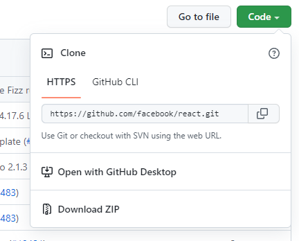
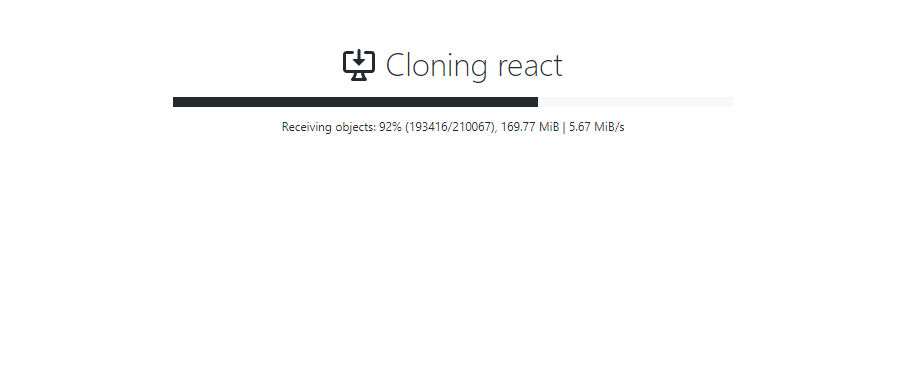
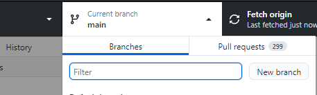
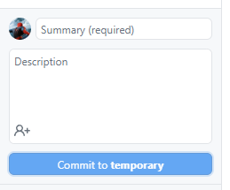
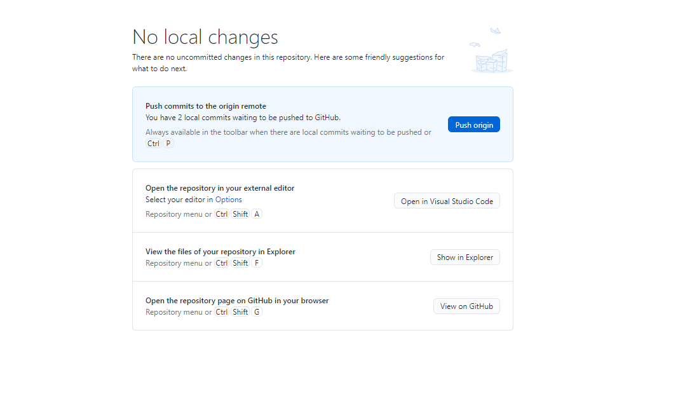
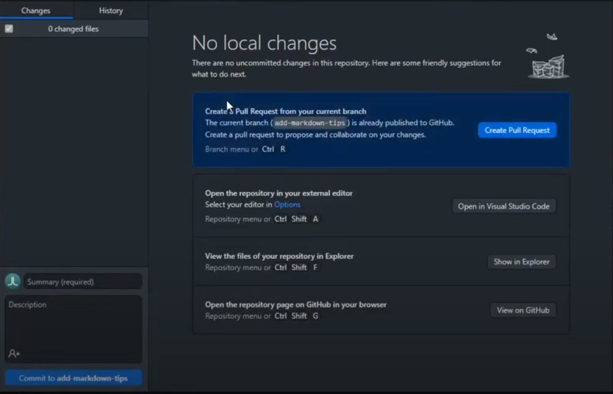
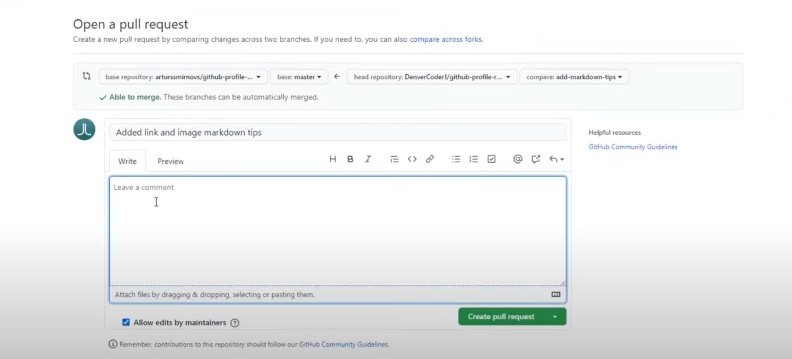
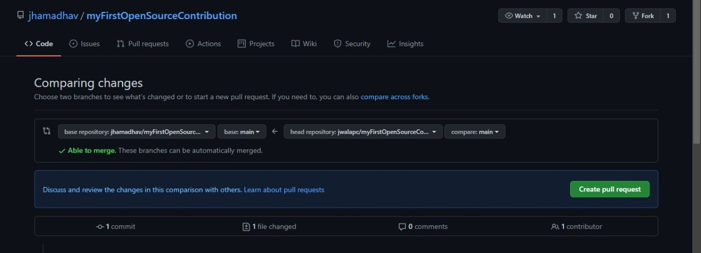

# Beginners Guide to the Open Source Contribution

# How to contribute in any Open-Source Project ?

Hi there, let me walk you through on how you can make your first Open-Source Contribution.

## Step 1: Install Github Dekstop

Download Github Dekstop from <a href="https://desktop.github.com/">here</a>. It is the easiest way to get started with Github 

---

## Step 2: Click on Open with GitHub Dekstop

To open any project on your local machine, click on open with Github Dekstop. This will clone the repository in your machine.

Click `Open with GitHub Dekstop`

  

---

## Step 3: Creating a new Branch

After cloning, the default branch is set to main. In order to make a pull request, we can create another branch. It resembles the main branch and the changes we make here can later on be merged with the main branch.

Click `New branch`

---

## Step 4: Make your changes in the new branch and Commit them

You can make any changes in the code and after that you are ready for making a pull request!
Commiting your changes means saving the changes your made and keeping them ready before publishing.

If it asks to fork the repository, then do it.

---

## Step 5: Publishing, Pushing and Starting a Pull Request

Now can publish your branch if not done and push it. This will make copy and store the branch on the github site.

Now you can start the pull request by clicking `Create pull request`

---

## Step 6: Make the Pull Request

Now you can fill details about the pull request you are making and submit it.

Add meaningful request message denoting your changes and then click `Create pull request`

---

with this you have successfully made your first contribution in an Open-Source projects!!!
